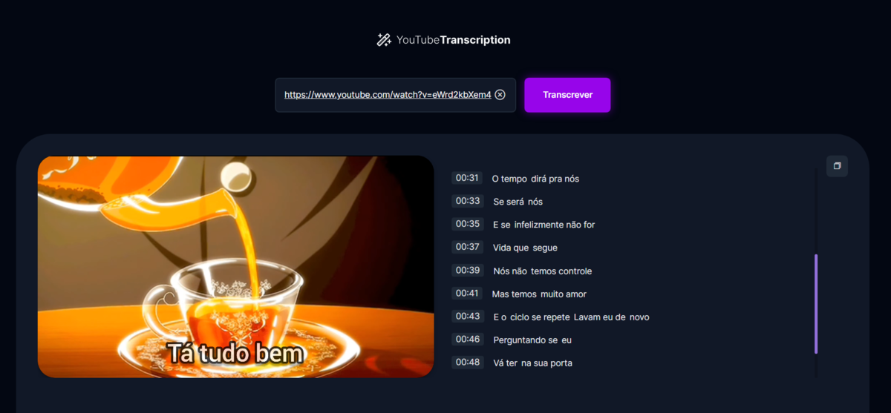

# video-transcription-with-AI

<p align="center">
  

  

   <a href="https://github.com/GianDutra/video-transcription-with-AI/commits/master">
    
  </a>
  
</p>

> Project developed as a RocketSeat challenge - Let's Code!

## Tech Stack

To create the website was used:

#### **Website**  ([NodeJS](https://nodejs.org)  +  [JavaScript](https://www.javascript.com/) + [Vite](https://vitejs.dev/))

- **[Phosphor Icons](https://phosphoricons.com/)**
- **[Express](https://expressjs.com/pt-br/)**
- **[Cors](https://developer.mozilla.org/en-US/docs/Web/HTTP/CORS)**
- **[Axios](https://axios-http.com/)**
- **[nytdl-core](https://github.com/fent/node-ytdl-core)**
- **[ffmpeg-static & fluent-ffmpeg](https://creatomate.com/blog/how-to-use-ffmpeg-in-nodejs)**
- **[transformers.JS (WhisperAI)](https://github.com/xenova/transformers.js)**
  
#### **API**
- **[YouTube Iframe API](https://developers.google.com/youtube/iframe_api_reference#Getting_Started)**

## 💻 Prerequisites
Before you start, make sure you have installed:

* [Node.js](https://nodejs.org/en/)
* [Git](https://git-scm.com)

## 🚀 Installing <video-transcription-with-AI>

 
```bash

# Clone this repository
$ git clone git@github.com:GianDutra/video-transcription-with-AI.git

# Access the project folder in your terminal
$ cd video-transcription-with-AI

# Install the dependencies
$ npm install

# Run the application in developer mode
$ npm run dev

# Run the node server in developer mode
$ npm run server

# The app will open by default on port: 5173 - go to http://localhost:5173/

```
#### Note: In the transcribe.js file, it is possible to change the language parameter, which defaults to Portuguese. 
#### Note2: You can also change "Xenova/whisper-small" to a more accurate one if you have a better computer (for instance, "Xenova/whisper-medium" or "Xenova/whisper-large").
#### Note3: Deploy deleted due to slow online server. If you want to use the app, use your own computer so the video doesn't take so long to load.
---


## 👨‍💼 Autor

<table>
  <tr>
    <td align="center">
      <a href="#">
        <br>
        <sub>
          <b>Gian Dutra</b>
        </sub>
      </a>
    </td>
  </tr>
</table>
